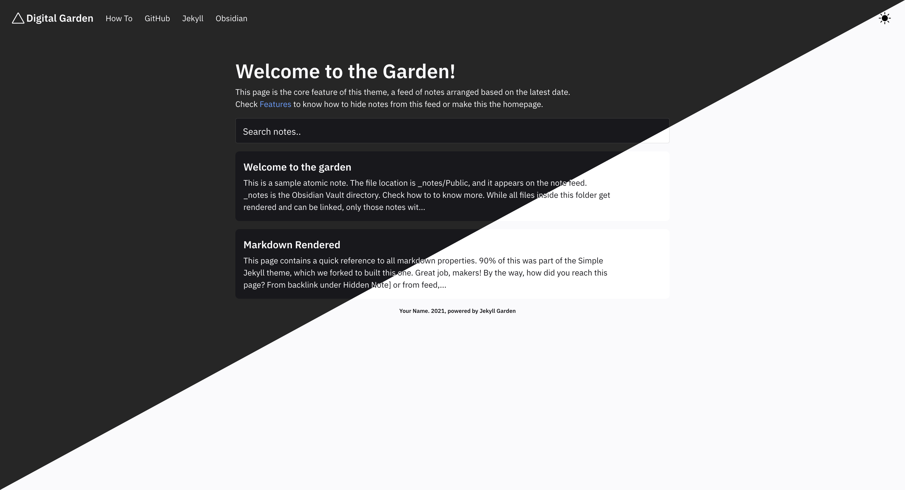

# Jekyll Garden v 0.3 (Stable)

This is a simple Jekyll theme created for building a digital garden with Obsidian and Github Pages. You have to fork this theme to your Github account, configure Github pages, and start using the `_notes` folder as the Obsidian vault. Check out [the demo](https://jekyll-garden.github.io/). 

## Installation (Github pages)
_Detailed Installation how-to, with screenshots available [here](https://jekyll-garden.github.io/posts/how-to)_

Building a Jekyll website on Github Page is simple and seamless.

- Step 1: Sign-In to Github, visit the theme page and click on 'Use this Template'
- Step 2: Name the forked repo as `yourusername.github.io`
- Step 3: Go to your repo's settings > pages and set the source to your main branch. 
- Step 4 (Optional): If you have a custom domain, set CNAME. 

Claps! The Jekyll website with a Note Garden theme is ready. Visit  `yourusername.github.io` to see that. 
_If it's not working, edit this readme (add something and commit) to trigger static page generation._

### Part 2, setting Github Repo with Obsidian.

- Step 1: Go to `yourusername.github.io`, and clone your repository to your machine. For this, you can use git-commands or install Github for desktop. 
- Step 2: Once you have successfully cloned the repository to your machine, Open the Obsidian app, and set the folder `_notes` inside the repository as your vault. 
- Step 3: You can start adding notes to this vault and add frontmatter to support. Read about YAML at `Welcome to the garden`.
- Step 4: Once you have enough notes, got to the Github Desktop app, commit the changes to main, and push the changes to Github. Github will update the pages!

## Credits & Thanks
- [rgvr](https://github.com/rgvr), who created [Simply Jekyll theme](https://github.com/rgvr/simply-jekyll). This theme is a fork of Simply Jekyll and 90% code is by Raghu.
- [Asim K T](https://github.com/asimkt), who coded the base HTML.
- [Santosh Thottingal](https://github.com/santhoshtr), [Binny V A](https://github.com/binnyva), Puttalu who introduced me to Digital Garden, Zettelkasten, Org Mode etc. :)
- Team [Obsidian](https://obsidian.md/) for making obsidian a [markdown](https://daringfireball.net/projects/markdown/) based product
- Dark Mode Switch by [Derek Kedziora](https://github.com/derekkedziora) - [Source link](https://github.com/derekkedziora/jekyll-demo/blob/master/scripts/mode-switcher.js)

## Contribution

To set up your environment to develop this theme, run `bundle install` after cloning this repository in your local machine.

Your theme is set up just like a normal Jekyll site! To test your theme, run `bundle exec jekyll serve` and open your browser at `http://localhost:4000`. This starts a Jekyll server using your theme. `_notes` contain all atomic notes. If you want to use this for blog, add posts inside `_posts` folder, following standard Jekyll frontamtter. 

## License

The theme is available as open source under the terms of the [MIT License](http://opensource.org/licenses/MIT).
