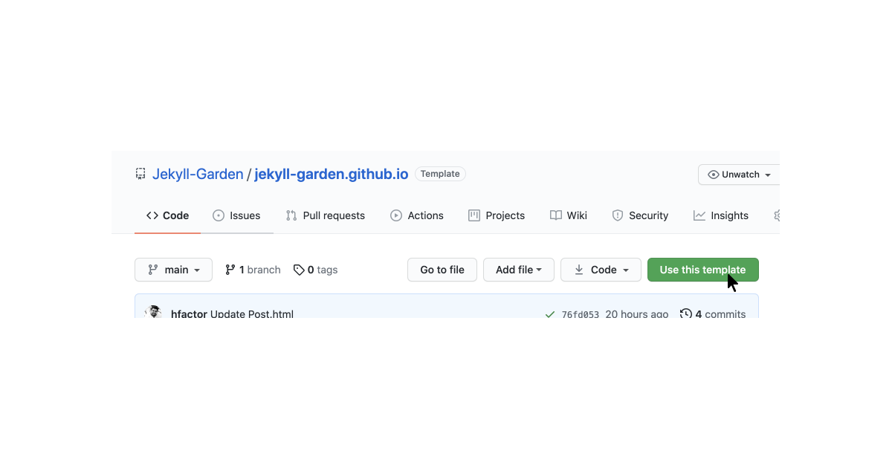
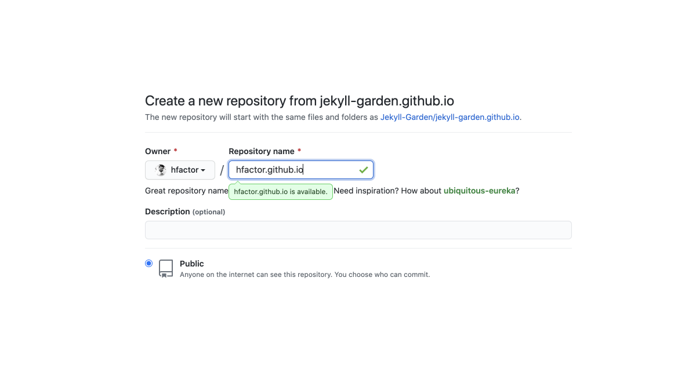
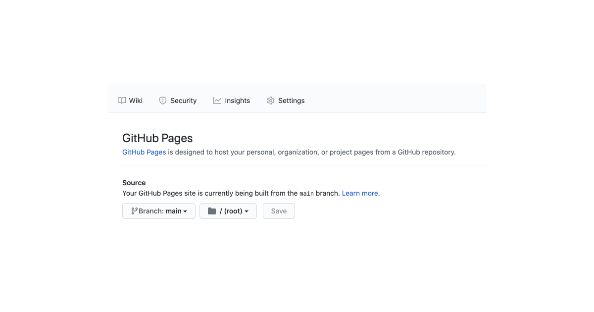
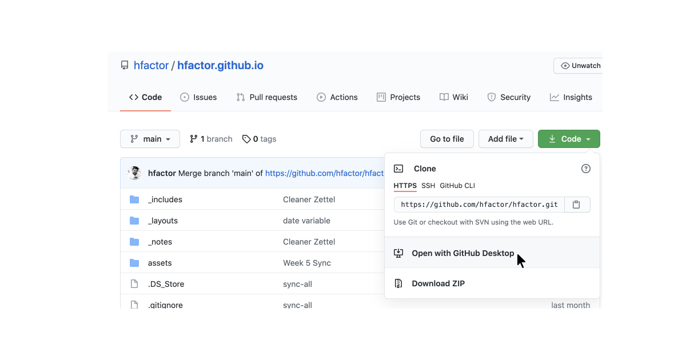
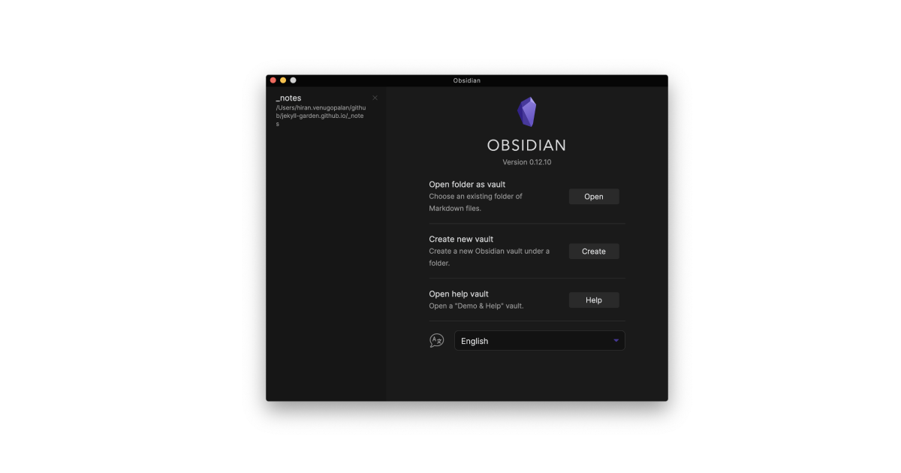
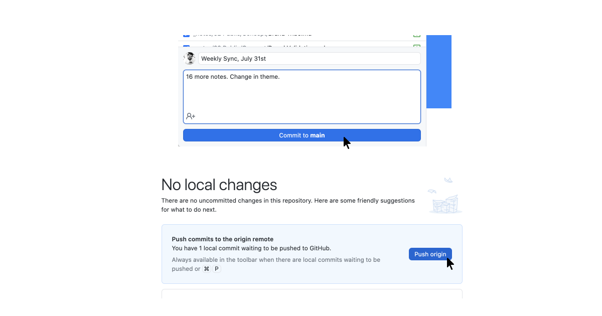

Jekyll garden is a theme over Jekyll that supports Obsidian formats, and few feautures. To install Jekyll to your server or local host, refer [these documents](https://jekyllrb.com/docs/installation/). [Docker file](https://github.com/Jekyll-Garden/jekyll-garden.github.io/blob/main/Dockerfile) is also available. 

Alternatively, you can use [Github](https://github.com/) and [Github Pages](https://pages.github.com/) as your server. It's very simple and almost low-code. Here is how to do it.  

**Step 1**: Sign-In to Github, visit the [theme page](https://github.com/Jekyll-Garden/jekyll-garden.github.io) and click on 'Use this Template'



**Step 2**: Name the forked repo as `yourusername.github.io`. My Github username is hfactor, hence it's hfactor.github.io




**Step 3**: Go to your repo's settings > pages and set the source to your main branch. 



**Step 4 (Optional)**: If you have a custom domain, set [CNAME](https://docs.github.com/en/pages/getting-started-with-github-pages/securing-your-github-pages-site-with-https). 

## Configuring Your Jekyll. 

Now you have Jekyll setup ready, go to `_config.yml` and set your configurations. Here you can do the following configurations : 
1. URL to set your hostname
2. BASEURL to set your sub path (url/subpath/)
3. Website Heading, Content, Copyright Year + Message
4. Private Link - On hover message
5. What all folders to exclude (Obsidian Template and all)

Edit these value via Github, and commit directly to Github, which will refresh the whole setup, and a Jekyll enivorment will be ready. You can visit the page by visiting  `yourusername.github.io`


## Syncing Github with Obsidian

Now you have your online publishing setup ready. It's time to build your local knowledge management using Obsidian. Here are the steps : 

Step 1: Go to github and clone your repository to your machine. For this, you can use git-commands or install [Github for desktop.](https://desktop.github.com/) 


Step 2: Once you have successfully cloned the repository to your machine, Open the Obsidian app in your machine, and set the folder `_notes` inside the repository as your vault. 


This is important, because Jekyll Garden can only fetch and publish notes from `_notes` folder. 

## Frontmatter

For all notes to work properly, we need to have three frontmatter values.  Please make sure the front matter is written in between three lines. If you check any .md files in this repo, you will see something this.  

```
---

title: Credits
feed: hide
date: 11-05-2022
permalink: /credits
format: list

---
```

1. `Title` is the page title. It **should be same as that of your Obsidian file** title for our Wiki links to work. i.e, if file is `credits.md` title has to be `credits`
2. If you want to show the note on the feed, you should set `Feed` as `show`. It's an optional value, and the default value is set to hide. (To avoid publishing by mistake)
3. `date` is used to sort note in feed. 
4. `permalink` is an optional value. Use it to set permanent URLs
5. `format:list` will change the layout to a list with border, Refer [[Credits]]. This is useful for Curated lists (Check [my personal library](https://hiran.in/list/reading) ) or while building MoC. 

## Updating Digital Garden

Once you have enough notes, got to the Github Desktop app, commit the changes to main, and push the changes to Github. Github will update the pages!


If you want to know my workflow or Obsidian folder structure, check [here]()

## Features
- Check [Features](../post/features) to know theme features

## Credits
- Check [[Credits]]